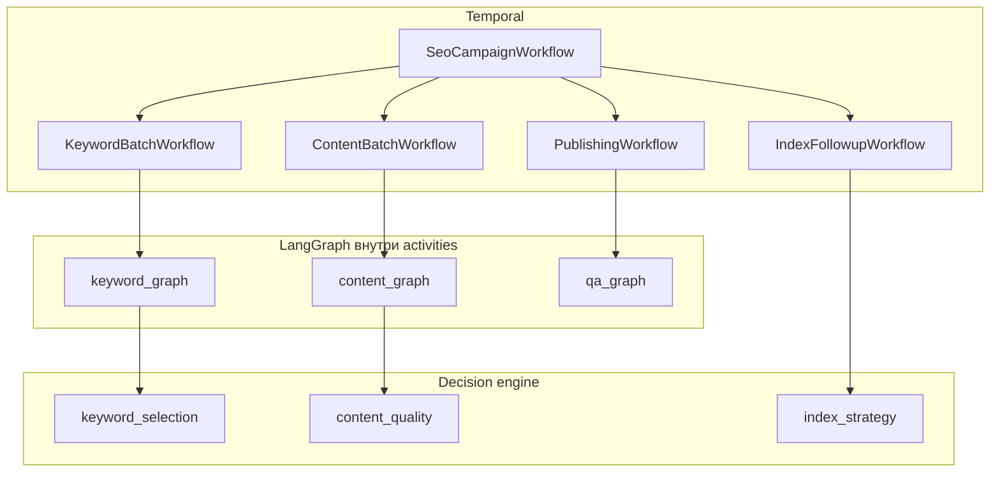
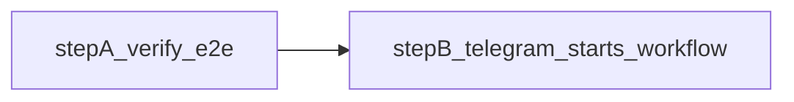

# Референс-архитектура: Temporal + LangGraph для SEO-пайплайна

## Принцип разделения

- **Temporal** — долгоживущие workflow, таймеры (T+1/3/7 дней), сигналы approve/reject, retries, child workflows, восстановление после сбоев. См. [Temporal Workflows](https://docs.temporal.io/workflows) и [Child Workflows](https://docs.temporal.io/child-workflows).
- **LangGraph** — выбор следующего агента, tool-calls, revision loops (writer → editor), [interrupts](https://docs.langchain.com/oss/python/langgraph/interrupts) для human-in-the-loop, [persistence/checkpoints](https://docs.langchain.com/oss/python/langgraph/persistence) для state одного job.




## Порядок реализации (утверждённый)

Главный риск после зрелой архитектуры — не имя workflow, а **незафиксированная доменная модель**. Поэтому порядок такой:

1. **Сначала DDL / Alembic (волна 1)** — зафиксировать сущности, FK, обязательные поля версионирования, **enums жизненного цикла**, индексы. Это «прибивает» план к земле и предотвращает переделку Temporal под меняющуюся схему.
2. **Затем runnable skeleton** — один parent workflow, два child workflow, одна `run_langgraph` activity, запись в `agent_decisions`, заглушка `decision_engine`, минимальный quality gate, проверка бюджета перед дорогим шагом.
3. **Потом** полноценные графы LangGraph и внешние интеграции (CMS, GSC, Playwright, SERP).

### Текущее состояние репозитория (синхронизация с кодом)

Уже реализовано (не дублировать как «следующий шаг» без необходимости):

- **Alembic:** `wave1_initial`, `external_task_links_002`; enum-зеркало в приложении.
- **Temporal:** `SeoCampaignWorkflow` (parent) → три child подряд: `KeywordBatchWorkflow` → `ContentBatchWorkflow` → `QaBatchWorkflow`; общий `pipeline_id`; очередь `TEMPORAL_TASK_QUEUE` (см. [src/seo_os/temporal/worker.py](src/seo_os/temporal/worker.py)).
- **LangGraph:** графы `keyword_trello`, `content_trello`, `qa_trello` (интеграция Trello REST, не LLM-узлы).
- **Инфра для разработки:** [docker-compose.yml](docker-compose.yml) для Postgres; CLI `seo-os-trello-lists` / `--bootstrap` для id колонок Trello.
- **Чат и бот:** [src/seo_os/api/](src/seo_os/api/) — FastAPI + `complete_chat` (OpenAI); [src/seo_os/bots/telegram_app.py](src/seo_os/bots/telegram_app.py) — Telegram long polling на тот же `complete_chat`; команды `/ping`, `/status`.

Диаграмма выше в документе — **референс на будущее** (`PublishingWorkflow`, `IndexFollowupWorkflow` в текущем коде нет); фактическое дерево parent → три child см. [campaign.py](src/seo_os/temporal/workflows/campaign.py).

### Зафиксированный порядок следующих шагов (утверждено)




1. **Шаг A — комплексная проверка Temporal + Postgres + Trello:** поднять БД, `alembic upgrade head`, `temporal server start-dev`, `seo-os-worker`, затем `seo-os-demo`; убедиться в движении карточки на доске Trello и записях в БД ([docs/STATUS_AND_TESTING.md](docs/STATUS_AND_TESTING.md)). Без стабильного шага A нет смысла подключать триггер из бота.
2. **Шаг B — связка бот → workflow:** та же логика старта, что в [demo.py](src/seo_os/cli/demo.py) (`Client.connect` + `start_workflow(SeoCampaignWorkflow.run, CampaignInput)`), вызываемая из Telegram-команды (и опционально из FastAPI). Ограничение доступа: `TELEGRAM_ALLOWED_USER_IDS`; в ответ — `workflow_id` и краткая инструкция смотреть Temporal UI / Trello.
3. **Шаг C — отчёты в Telegram:** workflow по-прежнему двигает карточку в Trello; дополнительно слать в чат короткие сообщения о завершении фаз / итоге parent (нужен канал из worker/activity в Telegram Bot API — не реализовано, см. todo `telegram-workflow-reports`).
4. **Шаг D — диалог «по workflow»:** разделить бытовой чат с LLM (`complete_chat`) и операционный режим кампании: хранить связь `telegram_user ↔ campaign_id/workflow_id`, при необходимости слать сигналы в Temporal, подключать LLM внутри графов LangGraph (todo `telegram-dialogue-workflow`, пересечение с `api-signals`).

### Что сделать перед первым полным интеграционным тестом (шаг A)

Это **не новая разработка**, а проверка стабильности уже существующего кода:


| #   | Действие                                                                                                     | Критерий «ок»                                                                                       |
| --- | ------------------------------------------------------------------------------------------------------------ | --------------------------------------------------------------------------------------------------- |
| 1   | `.env`: `DATABASE_URL`, `TEMPORAL_ADDRESS`, `TEMPORAL_TASK_QUEUE`, все `TRELLO_`*, бюджет/сид не ломают демо | Файл без заглушек `USER:PASSWORD` для Postgres, если используете Docker — совпадение с `POSTGRES_*` |
| 2   | `docker compose up -d postgres` (или свой Postgres)                                                          | Контейнер healthy / соединение с БД                                                                 |
| 3   | `alembic upgrade head`                                                                                       | Обе ревизии применены без ошибки                                                                    |
| 4   | `temporal server start-dev`                                                                                  | Порт 7233                                                                                           |
| 5   | `seo-os-worker`                                                                                              | Worker поднят, та же очередь, что у demo                                                            |
| 6   | `seo-os-demo`                                                                                                | В логах три summary; на доске Trello карточка прошла колонки; при желании SQL из STATUS             |


Пока шаг A не зелёный, **не имеет смысла** тестировать B/C/D как продукт — только отлаживать инфраструктуру.

### Целевое состояние (ваше видение) — как раскладывается по шагам


| Желание                                   | Где уже есть в коде                                  | Что добавить реализацией                                                                                                                         |
| ----------------------------------------- | ---------------------------------------------------- | ------------------------------------------------------------------------------------------------------------------------------------------------ |
| Стабильный Temporal + Trello              | Шаг A + существующие workflow/графы                  | Только стабильный прогон и мониторинг ошибок                                                                                                     |
| Задачи на доске Trello                    | `*_trello` создают/двигают карточку по `pipeline_id` | Уже есть; проверка визуально на шаге A                                                                                                           |
| Запуск кампании из Telegram               | Нет                                                  | **Шаг B**                                                                                                                                        |
| Бот «отчитывался» о ходе работ в Telegram | Нет (сейчас бот = только OpenAI-чат)                 | **Шаг C**: отправка сообщений из процесса worker (например activity `notify_telegram` или post-complete hook с `TELEGRAM_BOT_TOKEN` + `chat_id`) |
| Диалог со мной + работа «по workflow»     | Частично: диалог есть, связи с Temporal нет          | **Шаг D**: состояние диалога, команды approve, при необходимости LLM в графах и сигналы (`api-signals`)                                          |


**Важно:** шаги C и D **следуют** за B и требуют проектирования (куда слать уведомления: `chat_id` пользователя; как не смешивать отчёты и обычный `complete_chat`).

### Волна 1 миграций (минимальный первый пакет)

Включить в первый Alembic-пакет:

- `campaigns`, `sites`
- `keyword_candidates`, `keyword_scores`
- `content_briefs`, `article_drafts`
- `published_pages`, `qa_checks`
- `approvals`, `workflow_events`
- `agent_decisions`, `prompt_versions`
- `cost_tracking`, `campaign_budgets`

Если для `keyword_scores` или аналитики критичен сырой SERP, `**serp_snapshots` можно добавить ещё в волне 1**; иначе — перенос не блокирует skeleton, пока скоринг пишется из inline-данных activity.

### Волна 2 миграций (ускорение первого кода)

Отложить до второй волны, если цель — быстрее выйти на runnable-код:

- `serp_diffs`, `performance_snapshots`, `content_decay_signals` (и сопутствующие growth-сущности по мере появления фич).

## Lifecycle states: PostgreSQL enums (или справочники)

Зафиксировать явно до написания workflow-логики, иначе orchestration станет «ряхлым». Рекомендуемые типы (значения уточняются в миграции, имена колонок — `status` или специализированные):

- `**campaign_status`** — жизненный цикл кампании (напр. `draft`, `running`, `paused`, `completed`, `cancelled`).
- `**keyword_status`** — путь ключа (напр. `discovered`, `scored`, `shortlisted`, `approved_for_content`, `rejected`, `published`, `archived`).
- `**draft_status`** — стадии черновика/контент-job (напр. `brief_pending`, `writing`, `editing`, `quality_gate`, `human_review`, `approved`, `rejected`).
- `**page_status`** — после публикации (напр. `not_published`, `live`, `publish_failed`, `republish_pending`, `taken_down`).
- `**index_status`** — снимок с URL Inspection / агрегат (напр. `unknown`, `not_indexed`, `indexed`, `error`, `excluded`).
- `**approval_status`** — единый паттерн для human gates (напр. `pending`, `approved`, `rejected`, `superseded`, `expired`).

Реализация: `CREATE TYPE ... AS ENUM` в Postgres + маппинг в приложении (Python `Enum` / SQLAlchemy), либо таблицы-справочники, если нужна смена значений без миграции enum (trade-off зафиксировать в команде).

Переходы между состояниями документировать (короткая state machine в `docs/` или комментарии к миграции) — не обязательно в первом PR, но до разрастания workflow.

## Предположения (можно уточнить позже)

- Один **Python**-монорепозиторий с чёткими пакетами под сервисы; деплой workers/API отдельными процессами/контейнерами.
- **Postgres** — источник истины по сущностям; **Redis** — кэш/очереди при необходимости.
- **Temporal**: локально `temporal server` для разработки; прод — Temporal Cloud или self-hosted (на выбор команды).

## Структура репозитория (референс по папкам)

```
services/
  api_gateway/                 # FastAPI: campaigns, approvals, webhooks, budget/cost read API
  orchestrator/                # Temporal workers
    workflows/
      campaign_workflow.py
      keyword_batch_workflow.py
      content_batch_workflow.py
      publishing_workflow.py
      index_followup_workflow.py
    activities/
      run_langgraph.py         # вызов Agent Service по HTTP/gRPC
      integrations.py          # тонкие обёртки над Integration layer
  agent_service/               # LangGraph runtime (см. масштабирование ниже)
    graphs/
      keyword_graph.py
      content_graph.py
      qa_graph.py
    agents/
    state/
      schemas.py
  decision_engine/             # детерминированные правила и скоры (не LLM-толпа)
    keyword_selection.py
    content_quality.py
    index_strategy.py
  data/                        # Alembic, модели
  integrations/
  observability/               # OTEL, структурные логи, связка с agent_decisions
```

Пакет `integrations` — общий для gateway, activities и agent tools.

## Наблюдаемость внутри «чёрного ящика» `run_langgraph`

**Проблема:** одна activity `run_langgraph` скрывает шаги от Temporal (нет fine-grained retry на каждый LLM-шаг).

**Вариант A (рекомендуется для старта):** LangGraph на каждом значимом узле/transition пишет события в `agent_decisions` (или `workflow_events` с типом `agent_step`): `graph_name`, `node`, `input_summary`, `output_summary`, `tool_calls`, `latency_ms`, `prompt_version_id`, `job_id`. Temporal остаётся **coarse-grained**; дебаг и аудит — по БД и логам.

**Вариант B (тяжелее):** критичные фазы вынести в отдельные activities: `generate_brief`, `write_draft`, `seo_edit` — тогда retry на уровне Temporal по шагам, но растёт число activities и связность.

На практике: **A обязателен**, B — выборочно для самых дорогих/нестабильных шагов.

## Quality gates (жёсткие блокеры, не только «линейный QA»)

После редактора и при необходимости после brief:

- Считать `content_score` (числа 0–1), например: `intent_match`, `completeness`, `uniqueness`, `serp_advantage` (конкретная формула — в `decision_engine/content_quality.py`, может комбинировать эвристики + LLM-judge).
- **Hard gate:** если итог или ключевые оси ниже порога (напр. `< 0.75`) → **revision loop** в LangGraph (writer/editor), не публикация.
- Аналогично для keyword-этапа: пороги по `final_score` / обязательным полям из `keyword_scores` до human approval.

Пороги и веса — конфиг (per vertical), с версионированием (см. ниже).

## Формальная модель keyword scoring

Помимо `keyword_candidates` и при необходимости `serp_snapshots` — таблица `keyword_scores`:

- `keyword_id` (FK)
- компоненты: `demand_score`, `serp_weakness_score`, `intent_gap_score`, `authority_fit_score`, `risk_penalty`, …
- `final_score`
- `scoring_version` (строка или FK на `scoring_config_versions`) — обязательно для воспроизводимости и A/B.

Версионирование: при смене формулы новые строки пишутся с новым `scoring_version`; старые отчёты не «плывут».

## Retry и обработка ошибок (не один generic retry)

Разделить типы сбоев и поведение (часть в Temporal Activity options, часть в workflow-логике):

- **CMS / сеть:** exponential backoff, ограниченное число попыток activity.
- **QA fail (технический):** bug ticket → сигнал/дочерний fix workflow → republish → QA снова.
- **Indexing delay:** не ошибка — **отложенный recheck** (таймеры), не считать failed.
- **content_quality_fail / hallucination policy:** не retry того же текста слепо — **rewrite** через граф или отдельную ветку.
- **SERP misclassification:** переснятие снимка или повтор scoring с флагом uncertainty.

Документировать это как матрицу в коде `orchestrator/errors.py` или в `decision_engine`.

## IndexFollowup: три слоя (индексация ≠ performance)

1. **Layer 1 — Indexing:** indexed / not indexed; URL Inspection; canonical mismatch — из GSC/API.
2. **Layer 2 — Performance:** impressions, clicks, avg position (Search Analytics) по URL/query — «в индексе, но нет спроса/кликов».
3. **Layer 3 — Decision engine** (`index_strategy.py`), примеры правил:
  - indexed, нет impressions → улучшение интента / видимости (контент, внутренние ссылки).
  - impressions, низкий CTR → title/meta/snippet.
  - позиции 20–40 → усиление internal linking, уточнение подтопики.
  - длительное отсутствие в индексе → remediation workflow.

Таймеры T+1 / T+3 / T+7 остаются каркасом; на каждом тике собираются оба слоя данных и решается следующий шаг.

## Agent Service: избежать bottleneck

- Разнести нагрузку: отдельные **процессы/воркеры** или очередь задач (Redis/Rabbit) для keyword vs content vs QA; лимиты **concurrency** на LLM и на внешние API.
- Горизонтально масштабировать воркеры; stateless front + Postgres/checkpoints.

## Cost control

- Таблица `cost_tracking`: `campaign_id`, `keyword_id` / `article_id`, тип операции (completion, embedding, SERP call), `amount`, валюта, провайдер.
- `campaign_budgets` или поля в `campaigns`: лимит, потреблённое, soft stop / hard stop.
- Enforce: перед дорогими activity/графами проверка бюджета; при превышении — signal human или пауза workflow.

## Версионирование промптов и агентов

- `prompt_versions`: `agent_name`, `version`, `content_hash`, `rollout_at`, опционально ссылка на git ref.
- У артефактов: `article_drafts`, опубликованные метаданные — поле `generated_by` (JSON: `graph_version`, `prompt_version_id`, `scoring_version`).

Связка с observability: любой спор по качеству раскладывается по версии.

## SERP snapshot diff и growth

- Помимо `serp_snapshots`: сущность `serp_diffs` или вычисление diff между снимками: новые конкуренты, сдвиг типов результатов, потеря позиций — триггер для refresh/outreach/internal link планов.

## Внутренний линкинг (отдельный агент/узел)

- Узел или подграф **Internal Linking**: поиск релевантных страниц на сайте, предложение якорей и целей, обновление старых страниц (через CMS activities с approval при массовых изменениях).
- Включить в фазу после стабильного publish QA.

## Content decay monitor

- По расписанию (отдельный workflow или cron → Temporal): через 30–60 дней сравнение трафика/GSC с baseline; при просадке — **refresh workflow** (контент, мета, ссылки), не слепой rewrite без порога.

## Слой данных: ключевые таблицы (расширение)

**Control:** `campaigns`, `sites`, `workflow_events`, `approvals`, `audit_log`, `campaign_budgets`

**Research:** `keyword_candidates`, `keyword_scores` (+ `scoring_version`), `keyword_clusters`, `serp_snapshots`, `serp_diffs` (или materialized diff), `competitors`

**Content:** `content_briefs`, `article_drafts` (+ `generated_by`), `editor_revisions`, опционально `content_scores` (если не только в state)

**Execution:** `published_pages`, `qa_checks`, `bug_tickets`

**Growth:** `index_checks`, `performance_snapshots` (GSC metrics по URL на дату), `outreach_targets`, `backlinks`

**Ops / AI:** `agent_decisions`, `prompt_versions`, `cost_tracking`

Индексы: `(site_id, status)`, `(campaign_id)`, `(published_url)`, `(keyword_id, scoring_version)`.

## Temporal: иерархия workflow

1. `**SeoCampaignWorkflow` (parent)** — как раньше; учёт budget до запуска дорогих детей.
2. `**KeywordBatchWorkflow`** — кандидаты → скоринг (версия зафиксирована) → shortlist → human approval.
3. `**ContentBatchWorkflow`** — brief → write → edit → **quality gates** → optional human approval.
4. `**PublishingWorkflow`** — publish → QA; баги и republish.
5. `**IndexFollowupWorkflow`** — таймеры + слои 1–3 + ветки remediation/refresh.

Каждая когнитивная фаза — по возможности **одна** `run_langgraph` activity; внутренние шаги — в БД через `agent_decisions`.

## LangGraph: графы и MVP

- `keyword_graph` — Supervisor, discovery, при необходимости strategist; выход в `decision_engine.keyword_selection`.
- `content_graph` — brief, writer, editor, **content_score gate**, revision loop.
- `qa_graph` — валидация payload, затем activities CMS/Playwright.

State content job — по-прежнему богатый checkpoint; пороги quality — дублировать в таблицу при фиксации draft для аудита.

## Интеграции

- GSC: Search Analytics + URL Inspection.
- CMS, SERP, Playwright — как раньше; SERP хранить для diff.

## API Gateway

Эндпоинты кампаний и approvals; опционально read-only **cost/budget** и **версии** для отладки.

## Наблюдаемость

- `trace_id` / `campaign_id` / `job_id` везде.
- Шаги агентов — **обязательно** `agent_decisions` (или эквивалент), не только общие логи.

## Поэтапный запуск (содержательно)

1. **Волна DDL + enums** — доменная модель и статусы зафиксированы.
2. **Skeleton** — Temporal + одна LangGraph activity + `agent_decisions` + decision_engine stub + quality gate + budget.
3. **MVP продуктовый:** 3–4 агента, полный путь find → approve → write → publish → QA.
4. **Фаза 2:** competitor/SERP gap, IndexFollowup (3 слоя), GSC performance, internal linking v1.
5. **Фаза 3:** outreach (suggestion + approval), SERP diff, decay monitor, refresh workflows.

## Риски и ограничения

- Долгие паузы — Temporal; quality и scoring — явные правила + версии; линкбилдинг под контролем человека.

## Следующий артефакт по плану (актуально)

1. **Шаг A:** пройти таблицу предусловий выше и чеклист в [docs/STATUS_AND_TESTING.md](docs/STATUS_AND_TESTING.md).
2. **Шаг B:** запуск `SeoCampaignWorkflow` из Telegram/API по образцу [demo.py](src/seo_os/cli/demo.py).
3. **Шаг C:** прогресс/итог кампании в Telegram (отдельно от чата OpenAI).
4. **Шаг D:** диалог в контексте кампании + при необходимости сигналы Temporal из бота.

Дальше по референсу — полные графы с LLM, `api-signals`, IndexFollowup, волна 2 миграций (см. todos в шапке файла).

### Чеклист для автора миграций (волна 1, детали — в DDL/комментариях к Alembic, не в этом документе)

Для **каждой** таблицы волны 1 явно зафиксировать рядом со схемой:

- **Source of truth** — что считается каноническим состоянием сущности и кто его пишет (workflow, API, batch).
- **Идемпотентность** — какие поля/ключи обязательны, чтобы повторная activity или повторный webhook не порождали дубликаты и не ломали учёт.
- **Append-only vs mutable** — какие таблицы/типы строк только дополняются событиями, а какие допускают UPDATE по бизнес-правилам.

Особый контроль (типичная путаница «обновить строку» vs «вставить новое событие»): `workflow_events`, `agent_decisions`, `cost_tracking`, `approvals`.

---

Итог: каркас остаётся (**Temporal снаружи, LangGraph внутри**), усиление — **метрики, правила, feedback loops, версии, стоимость и наблюдаемость шагов**; реализация идёт **сначала от схемы данных и статусов**, затем от исполняемого каркаса, затем от полноты графов и интеграций.