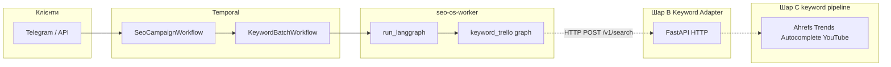
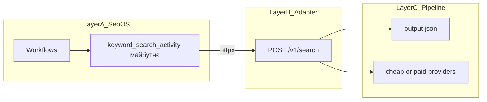

# Проєкт SEO OS і зовнішній пошук ключових слів

Цей документ пояснює, **що таке репозиторій SEO OS**, де в ньому логічно підключати **окремий сервіс пошуку за ключовими словами** (без AI/чатботів у тому проєкті), і **як організувати той зовнішній сервіс**, щоб інтеграція була передбачуваною.

Код інтеграції в SEO OS на момент написання **не обов’язковий** — тут зафіксовані контракт, змінні середовища та точки розширення.

---

## 1. Що таке SEO OS (wave 1)

**SEO OS** — монорепозиторій на Python 3.11: **PostgreSQL** (Alembic), пакет `seo_os`, **Temporal** для довгих процесів кампанії, **LangGraph** для фаз пайплайну, інтеграція **Trello** для видимості задач на дошці.

- **HTTP:** FastAPI — `GET /health`, `POST /v1/chat` (той самий LLM-шар, що й у боті, якщо задано `OPENAI_API_KEY`).
- **Telegram:** long polling, команда **`/campaign`** стартує **`SeoCampaignWorkflow`**: послідовно Keyword → Content → QA; після кожної фази — звіти в Telegram (activity `notify_telegram`), якщо налаштовано бота та worker.
- **Worker:** `seo-os-worker` виконує activities, зокрема **`run_langgraph`** — запуск іменованих графів LangGraph.

Корисні входи в код:

| Що | Файл |
|----|------|
| Реєстр графів і `run_langgraph` | [`src/seo_os/temporal/activities_impl.py`](../src/seo_os/temporal/activities_impl.py) |
| Фаза keyword за замовчуванням | [`src/seo_os/graphs/keyword_trello.py`](../src/seo_os/graphs/keyword_trello.py) |
| Child workflow keyword | [`src/seo_os/temporal/workflows/keyword_batch.py`](../src/seo_os/temporal/workflows/keyword_batch.py) |
| Батьківський workflow | [`src/seo_os/temporal/workflows/campaign.py`](../src/seo_os/temporal/workflows/campaign.py) |
| Загальний опис репо | [`README.md`](../README.md) |

### Межа відповідальності

- **Є:** оркестрація кампанії, Trello-картки, записи в `agent_decisions` / `external_task_links`, бюджетні перевірки (як у поточному коді), LLM лише в HTTP/ Telegram-чаті (не всередині графів keyword за замовчуванням).
- **Немає вбудованого** реального збору ключів з Ahrefs чи іншого keyword-провайдера: граф **`keyword_trello`** створює/прив’язує картку Trello і формує **заглушковий** handoff для контенту. Реальний список ключів має надходити з **нової інтеграції** або з **вашого окремого сервісу** по HTTP.

### Пов’язаний репозиторій «ahrefs api» (окремий проєкт на тій самій машині)

У вас може бути **інший каталог** (наприклад сусідній репозиторій `ahrefs api`), де зібрано **реальний keyword-discovery пайплайн** без AI/чатботів усередині логіки збору. Нижче — стислий зміст того, **що він уміє**, за checkpoint і документацією того проєкту; деталі залишаються там (`CHECKPOINT_*`, `pipeline/`, `FREE_CHEAP_*` runbook).

| Напрям | Що робить (суть) |
|--------|-------------------|
| **Ahrefs (платний API)** | Скрипти на кшталт `pipeline/collect_ahrefs.py`: збір сирих списків (competitor / seed / top pages), розширення **top pages → page keywords**, злиття та фільтри; артефакти в `pipeline/output/` (`*_raw.json`, `ahrefs_filtered.*`). Обмеження: **квота API units** (у checkpoint близько ліміту workspace → 403). |
| **Cheap / «безкоштовний» шар** | **Google Trends** (`collect_trends.py`): pytrends, опційно Google Suggest, RSS; фільтри loose → score → money, incremental novelty (`seen`), KPI `new` / `resurfaced`. **Autocomplete** (`collect_autocomplete.py` + `filter_autocomplete_igaming.py`). **YouTube** (`collect_youtube.py`, `run_youtube_incremental.py`): режими discover / hydrate / comments, квоти, вертикалі bingo/casino/dfs. У checkpoint також згадані **Reddit** і загальна схема **cheap discovery → paid validation** (Ahrefs лише для top-кандидатів за порогами з `config.json`). |
| **Керування експериментами** | Один `pipeline/config.json`: `seed_keywords`, `brand_keywords`, ліміти, секції `trends` / `youtube`; вихідні таблиці та звіти для порівняння прогонів. |
| **`docs/CURSOR_AI_COLLABORATION.md`** | Це **не** опис API збору ключів — там правила **як працювати з AI-асистентом у Cursor** (контекст, секрети, чеклисти). На інтеграцію HTTP воно не впливає. |

**Важливо для SEO OS:** той проєкт за замовчуванням — **пакетні Python-скрипти** і файли в `pipeline/output/`, а **не** HTTP-сервіс з контрактом з **розділу 4** нижче. Щоб **SEO OS** (`KEYWORD_SEARCH_BASE_URL`) міг викликати пошук у фазі keyword, потрібен **адаптер**: невеликий сервіс (наприклад FastAPI), який або (а) віддає вже зібрані результати з `output/` у форматі JSON з розділу 4, або (б) запускає обмежений сценарій збору за `correlation_id` / параметрами запиту й повертає масив `keywords`.

### Схема потоку (з місцем для зовнішнього API)



**Три шари:** **A — SEO OS** (оркестрація: Temporal, LangGraph, Telegram/API, Trello, кампанії). **B — Keyword Adapter** (тонкий HTTP-сервіс: `GET /health`, `POST /v1/search`, згодом опційно `POST /v1/search/batch`). **C — keyword pipeline** (другий репозиторій: збір, фільтри, артефакти в `pipeline/output/` або live-виклики провайдерів). Між A і C **не** має бути спільного Python-коду — лише контракт JSON.

### Єдиний план об’єднання (ціль)

| Роль | Проєкт |
|------|--------|
| **Оркестратор** | SEO OS: коли потрібен keyword search, викликає зовнішній сервіс, підставляє результат у content/QA flow. |
| **Keyword backend** | Другий репозиторій: Trends, Autocomplete, YouTube, Ahrefs, scoring / novelty — batch-артефакти або live discovery. |
| **Міст** | Adapter по HTTP: нормалізує відповідь, приховує різницю джерел. |

**Не робити:** фізично зливати репо; імпортувати другий проєкт як пакет у перший; запускати `pipeline/*.py` через `subprocess` з вузла LangGraph.



### Режими adapter-service

| `mode` | Поведінка |
|--------|-----------|
| **`cached`** (MVP) | Не запускати важкі пайплайни; читати останні `pipeline/output/*.json`, об’єднувати, фільтрувати за `query` / `seeds` / `sources` / `locale`, повертати top N. |
| **`cheap_live`** | On-demand лише дешеві джерела (Trends, Autocomplete, YouTube lite); Ahrefs не за замовчуванням. |
| **`validate_paid`** | Ahrefs / платна валідація лише за прапором або для shortlist; уникати дефолтного Ahrefs на кожен запит (квоти, 403). |

Стратегія другого проєкту узгоджується: **cheap discovery → paid validation**.

### Де підключати виклик у SEO OS (рекомендація)

**Переважно окрема Temporal activity** (`keyword_search_activity`), яка викликає adapter по HTTP: простіше **timeout**, **retry**, облік **429/5xx**, **correlation_id**, observability. Альтернатива — вузол у `keyword_trello` після картки Trello; для важкого I/O activity зазвичай **чистіша**.

У будь-якому разі HTTP з процесу **worker** (`httpx`), секрети з `.env`.

---

## 2. Де в SEO OS підключати зовнішній пошук (концепція)

Варіанти після узгодження контракту:

1. **Окрема Temporal activity** (рекомендовано) — до або після `run_langgraph` у [`KeywordBatchWorkflow`](../src/seo_os/temporal/workflows/keyword_batch.py): ізольовані таймаути та ретраї.
2. **Вузол графа** `keyword_trello` (або окремий граф) — HTTP після створення картки Trello; результат у `handoff_note` / `messages` для Content.

Виклик лише як **HTTP** до adapter, не як імпорт чи shell.

---

## 3. Інтеграція з боку SEO OS (коли з’явиться код)

Рекомендовані змінні в `.env` (імена можна уточнити під ваш контракт):

| Змінна | Призначення |
|--------|-------------|
| `KEYWORD_SEARCH_BASE_URL` | Базовий URL без завершального слеша, наприклад `https://keywords.example.com` |
| `KEYWORD_SEARCH_API_KEY` | Токен або ключ для заголовка `Authorization` / `X-Api-Key` |
| `KEYWORD_SEARCH_TIMEOUT_SEC` | Опційно; таймаут HTTP (узгодити з SLA зовнішнього сервісу) |

Практика:

- Один модуль-клієнт у `src/seo_os/integrations/` (за аналогією з [`trello.py`](../src/seo_os/integrations/trello.py)).
- **Кореляція запитів:** передавати у тіло або заголовки ідентифікатори `campaign_id`, `pipeline_id`, `job_id` з [`RunLangGraphInput`](../src/seo_os/temporal/shared_inputs.py), щоб зовнішній сервіс міг логувати й уникати дублікатів.
- **Помилки та ретраї:** тимчасові збої (5xx, мережа) краще обробляти політикою **retry** на activity в Temporal; 4xx — зазвичай без безкінечних ретраїв.
- **Таймаут workflow:** у [`keyword_batch.py`](../src/seo_os/temporal/workflows/keyword_batch.py) задано `start_to_close_timeout` для `run_langgraph`; для **`keyword_search`** activity — до **5 хв** (live trends може бути довгим; за потреби збільш `KEYWORD_SEARCH_TIMEOUT_SEC`).

**Клієнт:** [`keyword_search.py`](../src/seo_os/integrations/keyword_search.py) — `search`, `live_autocomplete`, `live_trends`, `live_youtube` (усі через один `KEYWORD_SEARCH_BASE_URL`).

**Поле `adapter_route`** у [`KeywordSearchInput`](../src/seo_os/temporal/shared_inputs.py) / **`keyword_adapter_route`** у [`KeywordBatchInput`](../src/seo_os/temporal/shared_inputs.py) (за замовчуванням `search`):

| Значення | Ендпоінт adapter |
|----------|-------------------|
| `search` | `POST /v1/search` |
| `live_autocomplete` | `POST /v1/live/autocomplete` |
| `live_trends` | `POST /v1/live/trends` |
| `live_youtube` | `POST /v1/live/youtube` |

Додаткові поля: `keyword_hl` / `keyword_gl`, `keyword_trends_config_path`, `keyword_trends_subprocess_timeout_sec`, `keyword_youtube_*`, `keyword_include_raw_ref` — передаються в activity при відповідному маршруті (див. [`activities_keyword_search.py`](../src/seo_os/temporal/activities_keyword_search.py)).

---

## 4. Як організувати зовнішній проєкт пошуку (для команди того репо)

Цей блок — для автора **окремого** проєкту (пошук по ключових словах без AI/чатботів). Мета: стабільний **HTTP API**, який SEO OS зможе викликати як звичайний клієнт.

### 4.1. Один чіткий HTTP API

- Краще **REST + JSON**, версія в шляху: наприклад `/v1/...`.
- Прикладі ендпоінтів (узгодити один стиль):
  - `POST /v1/search` — тіло JSON з параметрами пошуку, або
  - `GET /v1/keywords?query=...&limit=50` — якщо достатньо query-параметрів.

Важливо: **не змінювати без версії** обов’язкові поля відповіді, які вже споживає SEO OS.

### 4.2. Мінімальний контракт JSON (приклад)

**Запит** (`POST /v1/search`):

```json
{
  "query": "купити квартиру київ",
  "seeds": ["нерухомість", "новобудови"],
  "locale": "uk",
  "limit": 100,
  "correlation_id": "campaign-uuid_pipeline-uuid_job-uuid"
}
```

Поля `seeds`, `locale` — опційні, якщо ваш сервіс їх підтримує. `correlation_id` бажано приймати і логувати для трасування.

**Відповідь** (200 OK):

```json
{
  "keywords": [
    { "keyword": "купити квартиру київ центр", "volume": null, "source": "internal_index" },
    { "keyword": "новобудови київ 2026", "volume": 1200, "source": "partner_feed" }
  ],
  "meta": { "took_ms": 340 }
}
```

- Базові ключі об’єкта елемента: хоча б **`keyword`**; `volume` і `source` можуть бути `null`, якщо немає даних.
- Додаткові поля (`cpc`, `intent`, `score`, …) можна додавати — головне не ламати існуючі імена для споживача.

**Розширений запит** (узгоджується з єдиним планом; сумісний із мінімальним варіантом вище):

```json
{
  "query": "best crypto casino no kyc",
  "seeds": ["crypto casino", "no kyc casino"],
  "locale": "en",
  "limit": 50,
  "sources": ["autocomplete", "trends"],
  "mode": "cached",
  "correlation_id": "campaign-uuid_pipeline-uuid_job-uuid"
}
```

- **`mode`:** `cached` | `cheap_live` | `validate_paid` (див. таблицю режимів вище).
- **`sources`:** підмножина джерел, які має врахувати adapter (якщо сервіс підтримує).

**Приклад відповіді** з полями `meta.mode` та `meta.sources_used`:

```json
{
  "keywords": [
    {
      "keyword": "best crypto casino no kyc",
      "source": "autocomplete",
      "volume": null,
      "intent": "commercial",
      "score": 0.91
    },
    {
      "keyword": "crypto casino no verification",
      "source": "trends",
      "volume": null,
      "intent": "commercial",
      "score": 0.84
    }
  ],
  "meta": {
    "mode": "cached",
    "sources_used": ["autocomplete", "trends"],
    "took_ms": 340
  }
}
```

### 4.3. Єдина схема елемента keyword (нормалізація в adapter)

У другому проєкті різні джерела мають різні поля. **Adapter** зводить їх до однієї моделі; мінімум для SEO OS:

- Обов’язково: **`keyword`**, **`source`** (наприклад `ahrefs` | `trends` | `autocomplete` | `youtube` | `reddit`).
- Опційно: `volume`, `kd`, `cpc`, `intent`, `score`, `locale`, `topic` / `raw_ref` — щоб оркестратор не розпізнавав специфіку кожного пайплайна вручну.

### 4.4. Health / readiness

- Ендпоінт на кшталт **`GET /health`** або **`GET /ready`** — повертає `200`, коли сервіс готовий приймати запити (БД підключена, кеш тощо). Це спрощує перевірки перед деплоєм і діагностику з боку SEO OS.

### 4.5. Автентифікація

- Рекомендація: **`Authorization: Bearer <token>`** або окремий заголовок **`X-Api-Key`**. Токен видається окремо, зберігається лише в `.env` на машині з worker, **не** комітиться.

### 4.6. Обмеження та коди помилок

- **429 Too Many Requests** — при перевищенні квоти; бажано заголовки `Retry-After` або аналог.
- **4xx** — помилки валідації (не ретраїти без зміни запиту).
- **5xx** — тимчасові помилки сервера; Temporal може ретраїти activity за політикою.

### 4.7. Час відповіді (SLA)

- Документуйте очікуваний час (наприклад **p95 &lt; 30 с** для важкого пошуку). Якщо інколи довше — SEO OS має мати відповідні таймаути activity/workflow.

### 4.8. Документація для інтегратора

- Короткий **OpenAPI (Swagger)** або розділ у `README` з прикладом **`curl`**:

```bash
curl -sS -X POST "${KEYWORD_SEARCH_BASE_URL}/v1/search" \
  -H "Authorization: Bearer ${KEYWORD_SEARCH_API_KEY}" \
  -H "Content-Type: application/json" \
  -d '{"query":"test","limit":10,"correlation_id":"smoke-test"}'
```

Так команда SEO OS зможе один раз перенести контракт у код клієнта.

Опційно пізніше: **`POST /v1/search/batch`** для кампанійного режиму.

### 4.9. Що додати в проєкт 2 (keyword pipeline)

- Каталог на кшталт `services/keyword_api/` (FastAPI-додаток adapter).
- `README` з описом endpoint’ів, **`mode`**, маппінгу `pipeline/output/` → нормалізована схема keyword.

---

## 5. Що залишається поза цим документом

- У репозиторії SEO OS уже є **HTTP-клієнт** [`keyword_search.py`](../src/seo_os/integrations/keyword_search.py) і activity **`keyword_search`** ([`activities_keyword_search.py`](../src/seo_os/temporal/activities_keyword_search.py)); виклик з [`KeywordBatchWorkflow`](../src/seo_os/temporal/workflows/keyword_batch.py) після `keyword_trello`. Потрібен лише **запущений adapter** і `KEYWORD_SEARCH_*` в `.env`.
- Нові таблиці Alembic для зберігання списків ключів у БД SEO OS — за потреби після стабільного виклику adapter.
- Реалізація самого FastAPI adapter — у **другому** репозиторії або окремому деплої сервісу.

---

## 6. Етапи впровадження (roadmap)

| Етап | Зміст |
|------|--------|
| **1** | Документація і контракт (цей файл, `.env.example`, опційно STATUS) — **поточний фокус**. |
| **2** | MVP adapter: FastAPI, `GET /health`, `POST /v1/search`, режим **`cached`** (читання готових json/csv), нормалізація, сортування / dedup / limit; без live Ahrefs і без важкого shell-оркестратора. |
| **3** | Клієнт у SEO OS: `keyword_search.py`, env `KEYWORD_SEARCH_*`, activity `keyword_search` — **зроблено**; залишилось підняти adapter і URL. |
| **4** | Вбудовування у workflow: ключові слова в state / `handoff_note` / content phase; точка — keyword phase біля `KeywordBatchWorkflow`. |
| **5** | **`cheap_live`**: live-адаптери Trends / Autocomplete / YouTube lite в adapter. |
| **6** | **`validate_paid`**: Ahrefs лише для shortlist або за прапором; узгоджено з квотами. |

---

## 7. Антипатерни

1. **Прямий імпорт** другого репозиторію як Python-пакета в SEO OS — змішані залежності і релізи.
2. **`subprocess.run(...)`** з вузла графа або з activity без чіткого контракту — погані retry, парсинг stderr, ризик повторних важких прогонів.

---

## 6. Direct Sources in SEO OS (без зовнішнього adapter)

У поточній версії SEO OS додано direct-source маршрути в activity [`activities_keyword_search.py`](../src/seo_os/temporal/activities_keyword_search.py):

- `direct_discovery`
- `direct_autocomplete`
- `direct_trends`
- `direct_youtube`
- `direct_ahrefs`

Реалізація джерел:

- [`keyword_autocomplete.py`](../src/seo_os/integrations/keyword_autocomplete.py)
- [`keyword_trends.py`](../src/seo_os/integrations/keyword_trends.py)
- [`keyword_youtube.py`](../src/seo_os/integrations/keyword_youtube.py)
- [`keyword_ahrefs.py`](../src/seo_os/integrations/keyword_ahrefs.py)

Після збору застосовується базовий quality-stack:

- dedupe (topic-cap),
- scoring,
- novelty (seen registry),

модуль: [`quality.py`](../src/seo_os/keywords/quality.py).

Керування через env:

- `KEYWORD_SOURCE_PROFILE` (`cheap` | `balanced` | `ahrefs_validate`)
- `KEYWORD_SOURCE_TIMEOUTS` (формат `source:sec,source:sec`)
- `KEYWORD_SOURCE_BUDGETS` (формат `source:int`)
- `KEYWORD_MERGE_MODE` (`topic_cap` за замовчуванням)
- `KEYWORD_SEEN_FILE`

Це дозволяє запускати keyword-flow без залежності від зовнішнього HTTP adapter.
3. **Ahrefs за замовчуванням** на кожен запит ассистента — квоти, 403, вартість.
4. **Відсутність unified schema** — логіка `if source == trends` у SEO OS замість нормалізації в adapter.

---

## 8. Пов’язані матеріали в репозиторії

- Статус і тести: [`STATUS_AND_TESTING.md`](STATUS_AND_TESTING.md)
- Шаблон змінних: [`.env.example`](../.env.example)
- Окремий проєкт keyword-discovery (Ahrefs / cheap pipeline), якщо він клонований поруч: див. checkpoint і `pipeline/` у тому репозиторії; зв’язок з SEO OS — у підрозділі **«Пов’язаний репозиторій ahrefs api»** вище.
